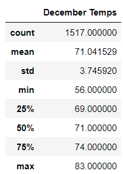

# Surf's Up Analysis

## Overview of the analysis
As W. Avy sets their sights on founding a surf shop that serves frozen treats, they want to find out how Oahu temperatures in peak *Summer* and peak *Winter* are for an idea on if the treats would be commercially viable year round. They've tasked us with filtering through the provided data to provide them with a good look on the climate. 

## Results
* Of the cuff, Oahu, Hawaii, is already a strong location for placing a year long ice cream shop already due to the tropical climate and about as close to the equator as Florida. With the expected temperatures from this pre-data analysis analysis, it will already be viable.

* As for the data given June, the middle of Northern Hemisphere Summer for Oahu, provides expected temperatures. As such, these temperatures with a mean of around __*74 degrees fahrenheit*__ are perfect for the sale of icey creams within the *Summer* months. Hawaii in general has a tropical climate, which bodes well even for the *Winter* months on whether it will be warm or not.

* Taking a look at the data for December proves the previous hypothesis of it *still* being a good season to sell both surf equipment and frozen treats. The mean of around __*71 degrees fahrenheit*__ which is *3 degrees* on average less than the toasty month of June, but still within a warmer zone compared to somewhere like New York City, placed at a higher latitude further fromt he equator and thus regularly getting snow. The small difference in these average degrees gives creedence to frozen treats __not__ having a large negative impact in sales due to the weather.

## Summary
As with the simple analysis and filtering done for the peak *Summer* and *Winter* months, it is clear that *Winter* sales of the frozen treats part of the shop won't suffer as much as it would if it were a colder climate. With the heat comes frozen treat sales. 

But that isn't the only thing to worry about when setting up shop in Oahu. I propose 3 more queries to take into consideration. 
First, is that December is __*not*__ the coldest month of the year for Hawaii, that would be February. With the data I queried, the avergae temperature is past the 70 degree mark at __*69 degrees fahrenheit*__. At this point it is *5 degrees* colder on average, which would reduce the sales even lower than in February, though still not as major a hit as if the average was closer to *60 degrees* or so, so it is within acceptable ranges.

Next, would be to find out the average precipitation. If it rains more in certain months, that would negatively impact both surf and frozen treat sales. Retrieving data for that would also help in planning a budget throughout the year.

Lastly, a data pull of how high and frequent the waves are around Oahu as well as where they are the highest/most frequent would help in establishing *exactly* where the store should be founded as well as how much surf equipment would be moved throughout the year.

